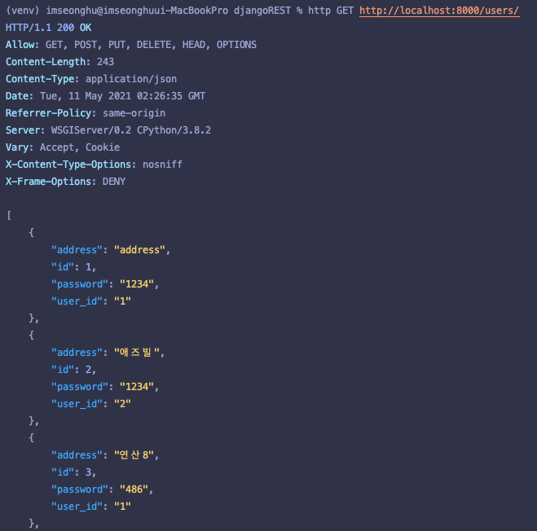
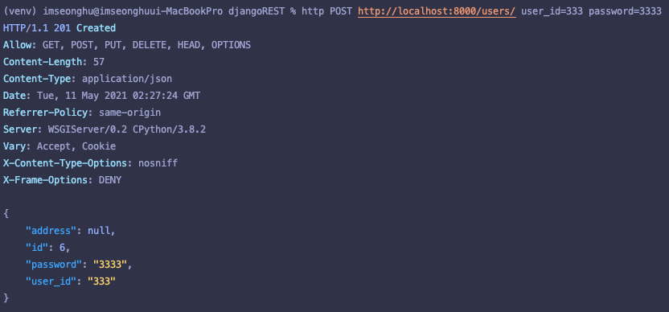

# Django Rest Framework Tutorial
<hr/>

> ### Goal
>✅ REST API: GET, POST, UPDATE, DELETE <br/>
>✅ Test in POSTMAN <br/>
>✅ Connect Frontend with React Server <br/>
>✅ Input value from React, Store it in Django <br/>


> ### trouble shooting 
> - postman 사용시 desktop version download 후 진행
> - cloud ver 진행 시, get 요청 에러
> - POST 요청 시, param에 데이터 넣는 것이 아닌, Body에 데이터 입력 (in POSTMAN)

<hr/>

### POSTMAN을 사용하지 않고, terminal에서도 HTTP 요청을 보낼 수 있다.
- GET <br/> 

- POST <br/> 

  

### CORS 해결
```python
>>> terminal) pip install django-cors-headers                                                      

# settings.py

INSTALLED_APPS = [
    ...
    'corsheaders', # 추가
]

# 추가
CORS_ORIGIN_WHITELIST = ['http://localhost:3000']

MIDDLEWARE = [
    'corsheaders.middleware.CorsMiddleware',  # 추가
    'django.middleware.common.CommonMiddleware',  # 추가
    ...
]
```